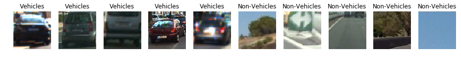

# Vehicle Detection
[](http://www.udacity.com/drive)


### Overview
In this project, we will use write a software pipeline to detect vehicles in a video (start with the test_video.mp4 and later implement on full project_video.mp4) however the main product is to create a detailed writeup of the project.

### Goals
- Histogram of Oriented Gradients (HOG)
  - Feature extraction on a labeled training set of images 
  - Train a classifier Linear SVM classifier using selected HOG features
- Sliding Window Search (SWS)
  - Implement a SWS technique
  - Use trained classifier to search for vehicles in images.
- Video Implementation
  - The SWS plus classifier has been used to search for and identify vehicles in the videos provided. 
  - Implement some kind of filter for false positives and some method for combining overlapping bounding boxes.
- Reflection

### Files
- [Notbook](Vehicle_Detection.ipynb)
- [Result](./test_videos/project_output.mp4)

### Loading and Visualizing the data
- Datasets provided by Udacity
  - [Car Images](https://s3.amazonaws.com/udacity-sdc/Vehicle_Tracking/vehicles.zip)
  - [NonCar Images](https://s3.amazonaws.com/udacity-sdc/Vehicle_Tracking/non-vehicles.zip)
  - Example of random sample images from the vehicle and non-vehicle datasets.



### Histogram of Oriented Gradients (HOG) 
#### Feature extraction from training images(HOW) and final parameters.

**HOG FINAL PARAMETERS**
```
color_space = 'YCrCb' 
orient = 9  
pix_per_cell = 8 
cell_per_block = 2
hog_channel = "ALL"
spatial_size = (16, 16) # Spatial binning dimensions
hist_bins = 16          # Number of histogram bins
spatial_feat = True     # Spatial features on or off
hist_feat = True        # Histogram features on or off
hog_feat = True         # HOG features on or off
```

The **get_hog_features** function takes in an image and computes the Histogram of Oriented Gradient (HOG).
Takes image as input and HOG parameters **(orientations, pixels_per_cell, cells_per_block)**

**Sample Result of Different HOG parameters**

| SVM Accuracy | Orientation | Pixels Per Cell| Feature Vector Length| Time|
|:------------:|:-----------:|:--------------:|:--------------------:|----:|
|98.59%|11|16|2|4356|237|
|98.45%|9|16|2|4140|110|
|97.38%|11|16|2|4356|104|
|97.61%|9|16|2|4140|107|
|**98.62%**|9|8|2|8460|103|

Color Space mainly used were RGB, YUV, YCrCb.

###### **Accuracy and Time taken were considered when finalizing HOG Parameters**


### Histogram of Oriented Gradients (HOG) 
#### Training classifier using selected HOG featres

**SVM Classifier** with the default classifier parameters using HOG features as indicated above was able to achieve test accuracy of **98.62%**.  Features were scaled to zero mean  and unit variance before training the classifier using sklearn's **StandardScaler** (slection for training/testing radomised using np's random).


### Sliding Window Search
##### Implementing sliding window search scales overlap windows.

Final Scales and window sizing
```
scales = [1, 1.5]
y_start_stops = [[380, 460], [380, 560]]
```

Different scales and windows found to be relevant as tried out in [notebook](Vehicle_Detection.ipynb) 

```
scales = [1, 1.5, 2, 2.5, 4]
y_start_stops = [[380, 460], [380, 560], [380, 620], [380, 680], [350, 700]]
```

After playing with sliding window the result was to use **find_cars** mthong from the lesson with bit of tweaking.
**cells_per_step = 1** used instead of overlap to define how many cells to step.


### Sliding Window Search
##### Example of test images using pipeline and performance optimization


Performance was optimized by using
- **heatmap**
- **threshold**
- **window sizing**

### Video Implementation
#### Link to final video where pipeline perform reasonably well.
- [Project Video Input](project_video.mp4)
- [Project Video Output](./test_videos/project_output.mp4)

- Pipeline perform reasonably well on the entire project video.
- Identifies vehicles most of the time.
- Minimum or no flase positives infact it even identifies vehicles coming from other side at times.
- Bit woobly and unstable bounding boxes at times.

### Video Implementation
#### Some kind of filter for false positives and some method for combining overlapping bounding boxes
- **find_cars** does **add_heat** for heatmap
- **find_cars** does **apply_threshold** for threashold
- **find_cars** which does **cells_per_step** to combining instead of overlapping for bounding boxes.
- **process_image** does scales and window sizing

### Reflection
#### Problems and issues faced and how could it be made more robust.
- Balancing the accuracy of the classifier with execution speed was the key.
  - If you do more on accuracy you start to drop boxes
  - If you do more on speed you end having false positives.
- Probably do better in presence of shadows
- Boxes could be better transition form one frame to another.
